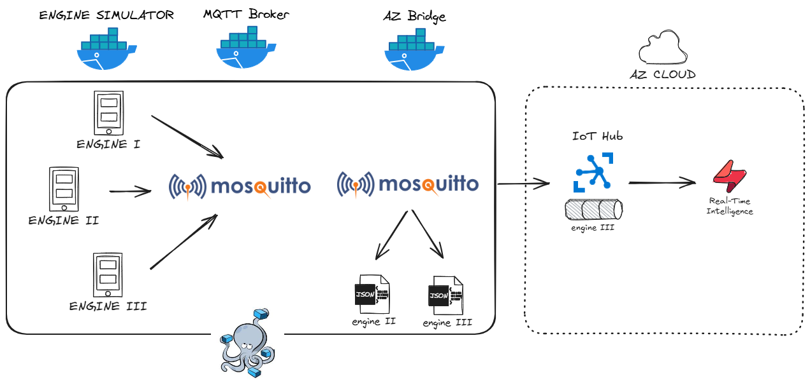

# IIoT Telemetry to the Cloud

## Architecture



## Repo Structure

```
engines/
├── README.md
├── .gitignore
├── docker-compose.yml
├── mosquitto/
│   ├── config/
│   │   ├── mosquitto.conf
│   └── log/
├── simul/
│   ├── Dockerfile
│   ├── requirements.txt
│   ├── engine1.py
│   ├── engine2.py
│   ├── engine3.py
│   ├── shared/
│   └── cronjobs/
│       ├── inject_anomalies_e1.py
│       ├── inject_anomalies_e2.py
│       ├── inject_anomalies_e3.py
│       ├── anomalies_e1.sh
│       ├── anomalies_e2.sh
│       ├── anomalies_e3.sh
│       └── crontab
└── az-bridge/
    ├── logs/
    ├── Dockerfile
    ├── requirements.txt
    └── az-integration.py
```
